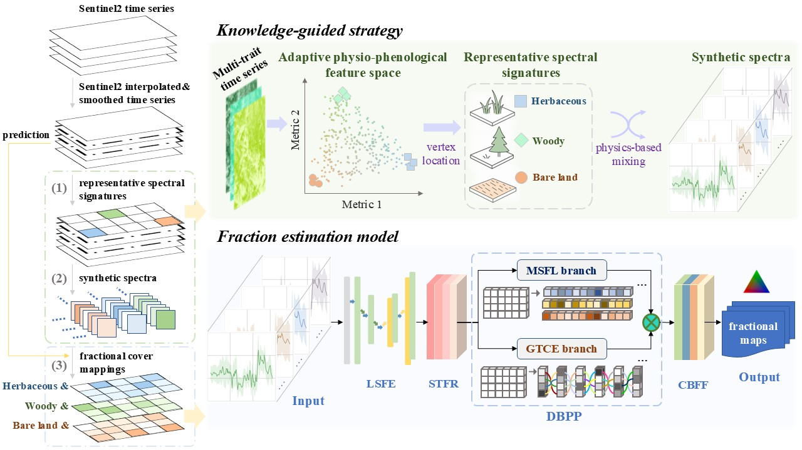
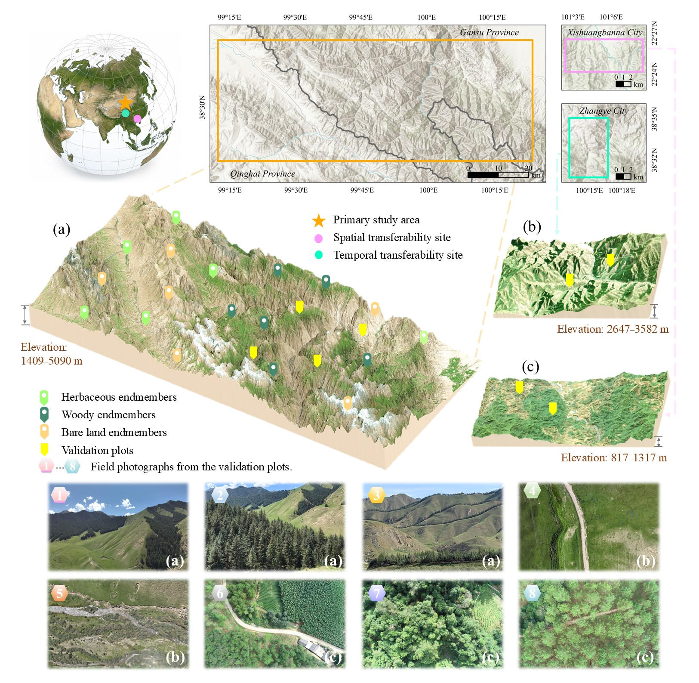
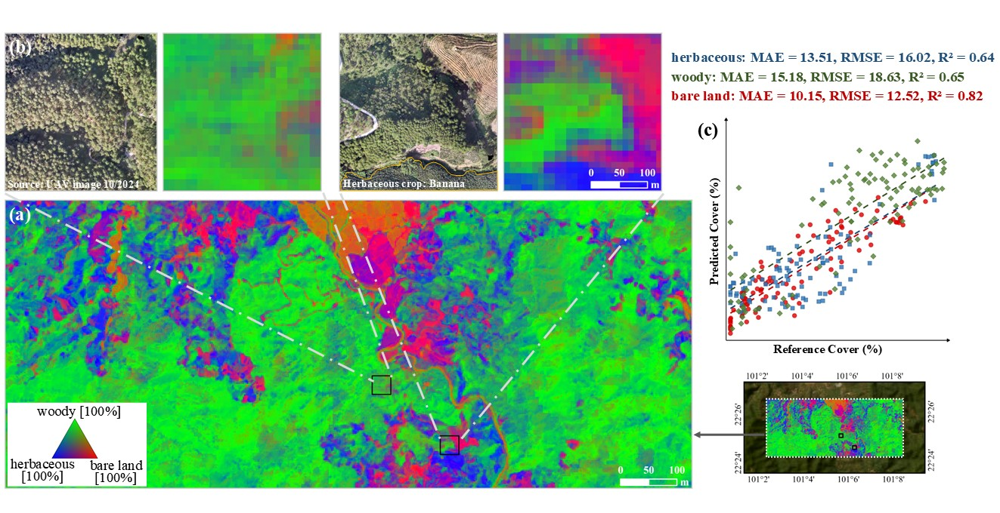

# Knowledge-Guided Unmixing Framework for Mountain Vegetation Mapping

This repository provides the code for the following paper:

**“Towards fractional vegetation cover mapping in complex mountain environments through a knowledge-guided unmixing framework.”**

## (1) Overview

Mountain vegetation dynamics are sensitive indicators of environmental change, yet fractional cover mapping remains difficult because field-measured spectral signatures are scarce in mountain terrain and complex vegetation mixtures create spectral ambiguity. We propose a knowledge-guided framework for annual mapping of herbaceous vegetation, woody vegetation, and bare land from Sentinel-2 time series. The framework automatically extracts representative signatures using adaptive physio-phenological feature spaces, incorporates nonlinear mixing mechanisms to construct synthetic spectra, and trains Unmix-Net for spectral-temporal fraction estimation. It was evaluated across broad climatic and vegetation gradients using high-resolution UAV reference data.

<p align="center"><br><em>Fig. 1. Illustration of the proposed knowledge-guided framework.</em></p>

## (2) Study area

The study regions comprise a primary site and a temporal assessment site in the central Qilian Mountains, together with a spatial assessment site in the southern Hengduan Mountains. They cover approximately 4,100 km², span elevations from 817 to 5,090 m, and represent climatic conditions from alpine to tropical environments. The landscapes include grasslands, shrublands, forests, and forest-grassland ecotones. UAV plots distributed across the three regions provided independent reference data.

<p align="center"><br><em>Fig. 2. Overview of the study regions and UAV validation plots.</em></p>

## (3) Results

<p align="center"><br><em>Fig. 3. Spatial assessment in the southern Hengduan Mountains.</em></p>

## (4) Environment requirements

- Setup Python environment

  ```bash
  conda create -n mountain-unmixing python=3.10
  conda activate mountain-unmixing
  ```

- Install these dependencies within `requirements.txt`

  ```bash
  pip install -r Code/requirements.txt
  ```

  Required packages:

  - `numpy>=1.24`
  - `pandas>=2.0`
  - `scipy>=1.10`
  - `rasterio>=1.3`
  - `geopandas>=0.14`
  - `shapely>=2.0`
  - `h5py>=3.9`
  - `matplotlib>=3.7`
